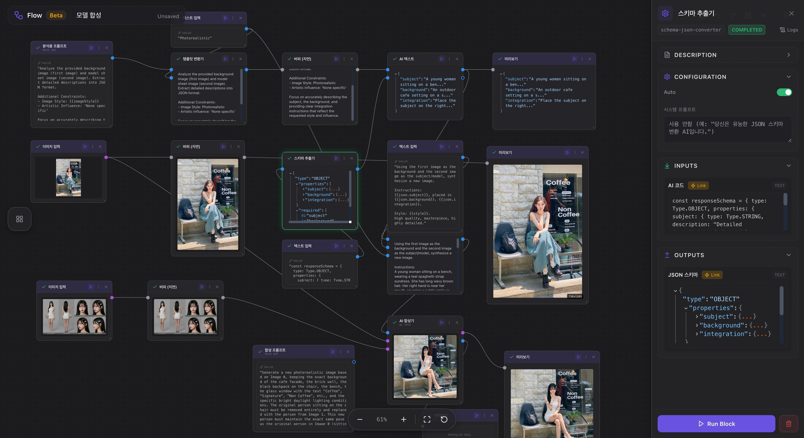

<p align="center">
  
</p>

<h1 align="center">flow-mcp</h1>

<p align="center">
  <a href="https://www.npmjs.com/package/@lemoncloud/flow-mcp"></a>
  <a href="https://www.typescriptlang.org/"></a>
  <a href="https://modelcontextprotocol.io/"></a>
  <a href="LICENSE"></a>
</p>

<p align="center">
  <b><a href="https://flow.eureka.codes">Eureka Flow</a>를 Claude에서 바로 사용할 수 있게 해주는 MCP 서버</b><br/>
  자연어로 워크플로우를 만들고, 실행하고, 결과를 확인하세요.
</p>

<p align="center">
  <a href="README.md">English</a>
</p>

<p align="center">
  <picture>
    <source media="(prefers-color-scheme: dark)" srcset="docs/images/screenshot-dark.jpg" />
    <source media="(prefers-color-scheme: light)" srcset="docs/images/screenshot-light.jpg" />
    
  </picture>
</p>

## 이런 걸 할 수 있어요

Claude에게 이렇게 말하면 됩니다:

| 하고 싶은 일 | Claude에게 이렇게 말하세요 |
|-------------|------------------------|
| 워크플로우 목록 보기 | "내 flow 목록 보여줘" |
| 새 워크플로우 만들기 | "텍스트 입력 → 버퍼 → 미리보기 flow 만들어줘" |
| 워크플로우 실행 | "1004897 flow 실행해봐" |
| 실행 결과 확인 | "미리보기 노드의 출력값 보여줘" |
| 구조 시각화 | "1004897 그래프 보여줘" |
| 노드 수정 | "1009369 노드 이름을 EurekaFlow로 바꿔" |
| 노드 추가 | "이 flow에 텍스트 입력 블록 하나 추가해줘" |
| 연결 | "입력 노드와 버퍼 노드를 연결해줘" |
| 삭제 | "연결 안 된 노드 정리해줘" |

코드를 몰라도, 도구 이름을 몰라도 됩니다. 자연어로 요청하면 Claude가 알아서 처리합니다.

## 시작하기

### 1단계: 설치

```bash
npm install -g @lemoncloud/flow-mcp
```

### 2단계: API 키 발급

[Eureka Codes 콘솔](https://console.eureka.codes)에서 API 키를 발급받으세요.

### 3단계: Claude Desktop 설정

`~/Library/Application Support/Claude/claude_desktop_config.json` 파일에 추가:

```json
{
  "mcpServers": {
    "flow-mcp": {
      "command": "npx",
      "args": ["-y", "@lemoncloud/flow-mcp"],
      "env": {
        "FLOW_API_KEY": "발급받은-API-키"
      }
    }
  }
}
```

### 4단계: 시작!

Claude Desktop을 재시작하고 **"내 flow 목록 보여줘"** 라고 말해보세요.

> **참고:** `FLOW_API_KEY`만 있으면 바로 사용할 수 있습니다. API URL은 기본값이 설정되어 있습니다.

### 설정 옵션

| 환경변수 | 필수 | 기본값 | 설명 |
|---------|:---:|--------|------|
| `FLOW_API_KEY` | O | — | API 인증 키 |
| `FLOW_API_URL` | | `https://api.eureka.codes/flw-v1` | API 서버 주소 |
| `FLOW_API_TIMEOUT` | | `30000` | API 요청 타임아웃 (ms) |
| `FLOW_WS_URL` | | — | WebSocket 주소. 설정하면 실행 중 실시간 진행상황을 볼 수 있습니다. |

## 사용 예시

### 워크플로우 만들기

```
"사용 가능한 블록 보여줘"
→ 입력/처리/출력 블록 목록 표시

"텍스트 입력, 3초 버퍼, 미리보기로 연결된 flow 만들어줘"
→ 노드 3개 + 엣지 2개 자동 생성

"만든 flow 실행해봐"
→ 실시간 진행상황 표시 → 결과 반환
```

### 기존 워크플로우 수정

```
"1004897 flow 로드해줘"
→ 노드, 엣지, 포트 데이터 표시

"입력 노드의 텍스트를 Hello Eureka로 바꿔"
→ config.text 변경

"여기에 출력 블록 하나 더 추가하고 연결해줘"
→ 새 노드 추가 + 연결

"그래프 보여줘"
→ Mermaid 다이어그램 표시
```

### 실행 결과 분석

```
"전체 실행해봐"
→ 각 노드별 진행상황 + 완료 여부 표시

"미리보기 노드의 출력값은?"
→ 포트 데이터 (값, 타입, 타임스탬프)
```

## 15개 도구

자연어로 요청하면 Claude가 자동으로 적절한 도구를 선택합니다.

| 도구 | 하는 일 |
|------|--------|
| `block_list` | 사용 가능한 블록 종류 조회 |
| `flow_list` | 내 워크플로우 목록 |
| `flow_load` | 워크플로우 상세 로드 (노드, 엣지, 포트) |
| `flow_graph` | Mermaid 다이어그램 시각화 |
| `flow_create` | 새 워크플로우 생성 (노드+엣지 한 번에) |
| `flow_update` | 워크플로우 이름/설명 변경 |
| `flow_save` | 전체 재구성 (주의: 기존 노드 ID 변경됨) |
| `flow_run` | 워크플로우 실행 + 실시간 모니터링 |
| `flow_delete` | 워크플로우 삭제 |
| `node_create` | 기존 flow에 노드 추가 |
| `node_run` | 단일 노드 실행 |
| `node_get_port` | 노드 입출력 데이터 조회 |
| `node_update` | 노드 설정/라벨/위치 등 수정 |
| `node_delete` | 노드 삭제 |
| `edge_create` | 두 노드 연결 |
| `edge_delete` | 연결 제거 |

---

<details>
<summary><b>개발자 가이드</b></summary>

### 설치 및 빌드

```bash
git clone https://github.com/lemoncloud-io/flow-mcp.git
cd flow-mcp
npm install
npm run build
```

### 명령어

| 명령어 | 설명 |
|--------|------|
| `npm run build` | TypeScript 컴파일 |
| `npm run dev` | Watch 모드 |
| `npm run lint` | ESLint |
| `npm run lint:type` | 타입 체크 (`tsc --noEmit`) |
| `npm run format` | Prettier 포맷 |
| `npm start` | MCP 서버 실행 (stdio) |
| `npm test` | 테스트 |

### 로컬 빌드로 연결

```json
{
  "mcpServers": {
    "flow-mcp": {
      "command": "node",
      "args": ["/absolute/path/to/flow-mcp/dist/stdio.js"],
      "env": {
        "FLOW_API_KEY": "your-api-key",
        "FLOW_WS_URL": "wss://wss.eureka.codes/wss-v1"
      }
    }
  }
}
```

### 아키텍처

```
stdio.ts (console suppression + JSON-RPC filter)
  -> server.ts (McpServer + 15 tools)
    -> tools/*.ts (tool handlers)
      -> api-client.ts (Axios -> flows-api REST)
      -> ws-client.ts (WebSocket -> real-time execution events)
      -> config.ts (Zod v4 env validation)
```

### WebSocket 실행 흐름

```
1. WS 연결 (info= 파라미터 → connectionId 수신)
2. 실행 트리거 (POST /nodes/:id/run?connection=<connId>)
3. 이벤트 모니터링 (노드 상태 + 포트 업데이트)
4. 완료 감지 (전체 terminal 또는 1.5초 quiet period)
5. 전체 이벤트 로그 포함하여 결과 반환
```

### npm publish

```bash
npm run build
npm publish --access public
```

</details>

## 관련 프로젝트

- [Eureka Flow](https://github.com/lemoncloud-io/eureka-flow) — 비주얼 워크플로우 에디터 (프론트엔드)

## 라이선스

Apache-2.0 -- [LemonCloud](https://lemoncloud.io)
